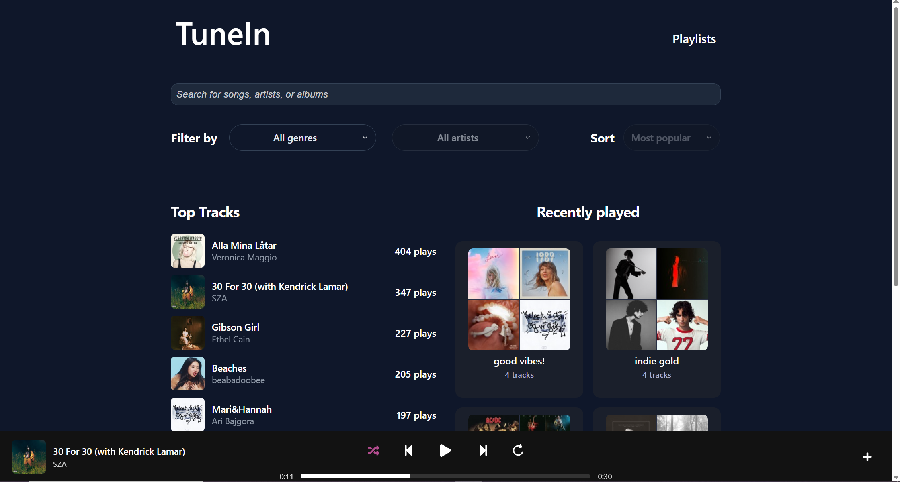
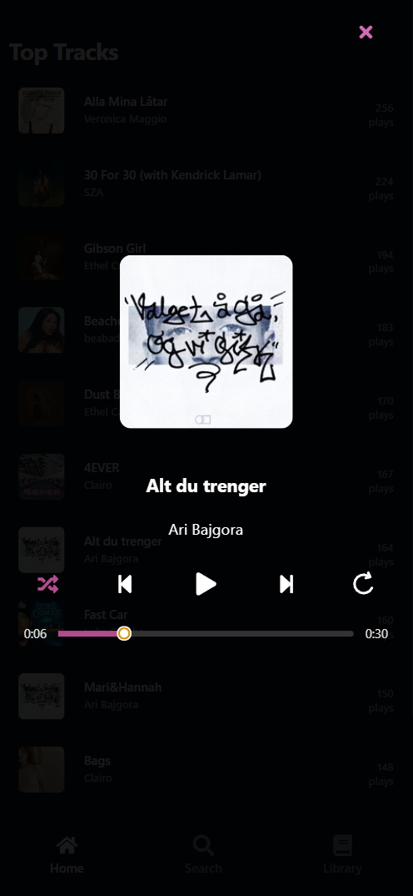
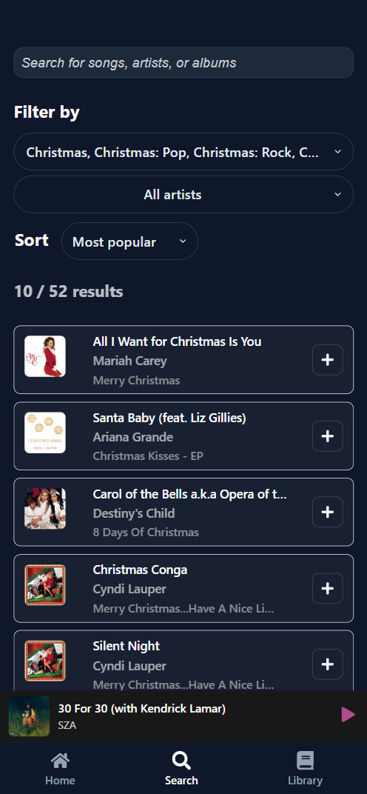
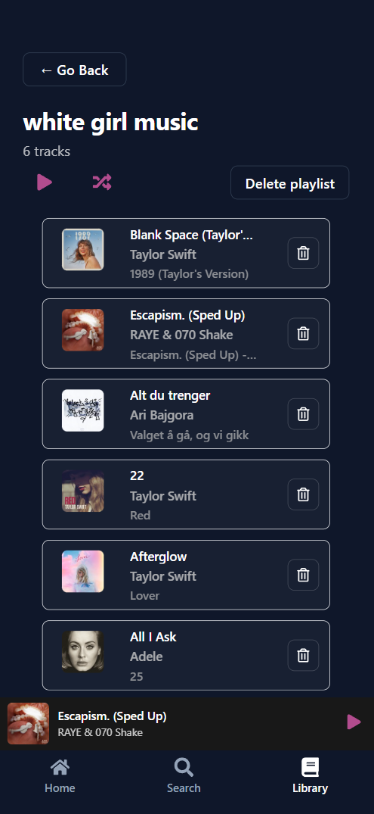

# Application Showcase

**Note:** This is an example of what the application can look like. 

Your view might look a little different depending on your personal playlists.

## Home Page

## Search functionality

### Filter by artist

## Playlists
### Your Playlists 

### Personal playlist - "rock on"

## Mobile view (iPhone 14 Pro Max)

### Top Tracks - Mobile

### Now playing - Mobile

### Search functionality - Mobile

### Playlist - Mobile

